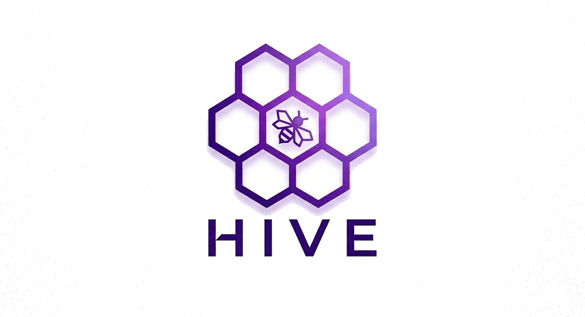
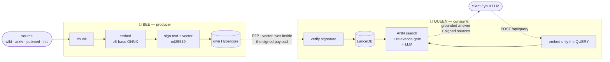

<div align="center">



### Wikipedia for machines — a decentralized, verifiable knowledge base built for LLMs.

A peer-to-peer network of autonomous **BEEs** that extract knowledge from the
open web, **sign every fact** with ed25519, and sync it over Hypercore. LLMs
query HIVE to get **up-to-date, source-traceable** answers — no central server,
no black box.

**[Manifesto](./MANIFESTO.md) · [Architecture](./docs/ARCHITECTURE.md) · [Changelog](./CHANGELOG.md)**

</div>

---

## Why HIVE

LLMs are frozen at training time and hallucinate sources. The usual fix — RAG —
means standing up your own crawler, embedder, and vector DB, and trusting
whatever it scraped. HIVE makes that knowledge layer **shared, verifiable, and
serverless**:

- 🔏 **Every fragment is signed.** ed25519 over the text *and* its embedding
  vector. You can prove who produced a fact and that it wasn't altered.
- 🌐 **Peer-to-peer, no middleman.** Nodes find each other over a DHT and
  replicate append-only logs directly. There's no "HIVE Inc." server between
  you and the data.
- 🧠 **Built for retrieval.** Multilingual embeddings (e5-base), deterministic
  chunking, and a tuned relevance gate — ask in Spanish, match an English
  source.
- 🪶 **Run a contributor in one command.** No API key, no cloud bill.

---

## How it works

Two kinds of node — **BEEs** produce knowledge, **QUEENs** consume it. The
key v0.8 insight: **bees embed, queens don't.** Each bee chunks, embeds and
signs its own vectors; the queen just verifies the signature and stores the
already-computed vector. A queen's per-fragment cost is a database upsert —
not a model forward pass — so one queen can aggregate hundreds of bees.



→ Full mechanics, schema, and configuration in **[docs/ARCHITECTURE.md](./docs/ARCHITECTURE.md)**.

---

## What it's for

Distributed RAG — public and private, specialized and general, for local or
cloud LLMs. Run your own knowledge base, or share it peer-to-peer with no server
in the middle. **The same protocol composes into seven deployment patterns:**

**01 · Public** — *Join the public swarm with one topic hash.*
A queen joins the public HIVE by hashing a known string —
`sha256("hive-network-v0.1")` — and calling `swarm.join(topic)`. Hyperswarm's
DHT introduces it to every BEE on that topic; native Hypercore replication
brings their signed fragments down with no central registry. Specialized public
meshes are just a different string (`hive-medical-v0.1`, `hive-legal-v0.1`).

**02 · Private** — *Run a private swarm for internal use.*
Three knobs flip the network private: a random 32-byte topic (2²⁵⁶ space),
Hypercore encryption keys (cores are ciphertext at rest and on the wire), and a
pubkey allowlist. Internal BEEs index company wikis, tickets, repos, contracts;
a queen serves `/api/query` — no traffic ever leaves the perimeter.

**03 · B2B** — *Share private knowledge between companies.*
Two orgs exchange three values out-of-band — swarm topic, encryption key, each
side's queen pubkey for the allowlist. Both queens join the same private swarm
and replicate only the BEEs the other party chose to expose. Each company keeps
its own queen, its own LanceDB index, its own audit trail. Revocation is a key
roll or an allowlist edit.

**04 · Hybrid** — *One queen in many swarms.*
A single queen joins as many topics as it has credentials for — public mesh, its
own private swarm, every partner swarm — and replicates BEEs from all of them
into one index. One query, one synthesis, sources from every swarm. Every
fragment keeps its origin pubkey + signature, so provenance survives the merge.

**05 · Extensibility** — *Custom connectors as ForagerSource plugins.*
Wire in a legacy ERP, an in-house REST API, or a proprietary archive by
implementing the `ForagerSource` interface (seed / fetch / normalize / owns),
publishing it as an npm package, and adding its id to the BEE's manifest. No
fork of HIVE core, no central registry — the connector lives in your repo.

**06 · Local AI** — *Queen with a local LLM — full offline stack.*
Point the queen's pluggable LLM client at Ollama and the entire stack runs
on-prem — BEEs extracting + embedding, the queen indexing in LanceDB, synthesis
local. Retrieval gives a small model grounded, signed context at query time, so
it behaves like a much larger one on domain-bounded tasks. Zero cloud traffic.

**07 · Training** — *Training corpus with cryptographic provenance.*
BEEs store extraction verbatim — no LLM in the loop, no paraphrase. Every
fragment carries source URL, scope, timestamp, and an ed25519 signature. Stream
fragments straight off the queen's replicated Hypercores into a pre-training,
SFT, or distillation pipeline; filter by source, scope, language, or signing
BEE. Per-fragment, verifiable provenance — useful for licence propagation and
dataset audit.

**LLM client integrations** *(case 14–16)* — `@capybaralabs/hive-mcp` ships
the MCP server for Claude Desktop, Claude Code, Cursor, Continue, Goose,
[OpenClaw](https://openclaw.io/) (and the rest of the MCP ecosystem). For
behavioural guidance — when Claude should reach for HIVE vs WebSearch, how to
read scores, how to cite — install the [hive-research Claude Skill](./skills/hive-research/)
on top.

→ The full catalogue (the seven above plus client-integration, personal-memory,
team-knowledge, codebase-context, journalism/OSINT and more) lives in
**[docs/USE-CASES.md](./docs/USE-CASES.md)** — cite cases by stable ID.

---

## Quick start

The fastest path is the npm package — one command, then configure in the
browser:

```bash
npx @capybaralabs/hive
```

First run asks **one question — the role** (`bee` / `queen` / `hive`), since
that's the only thing the web UI can't change later. Skip the prompt by naming
the role directly:

```bash
npx @capybaralabs/hive bee      # producer, no LLM key
npx @capybaralabs/hive queen    # query node (LLM)
npx @capybaralabs/hive hive     # both in one process (default)
```

It then generates an `HIVE_API_KEY`, writes config to `~/.config/hive/.env`,
and starts. **Open `http://localhost:8080` and the Settings panel guides you
through the rest** — declare your knowledge sources, pick a public or private
topic, and (for query nodes) set your LLM provider + key. The node won't extract
or answer until you save: hit **Save & restart** and it comes up configured.
Subsequent runs read the saved config and start directly.

> Headless/CI deploy with no browser? Set `HIVE_AUTOSTART=1` (the bundled
> `docker-compose.yml` already does) so the node extracts on boot using its
> env-var config instead of waiting for the web setup.

For more control, the rest of this section shows the **Docker** path (nothing
to install but Docker) and the **from-source** path (Node 22+, clone the
repo). Both stay supported.

### 🐝 Contribute — run a BEE
The lightest thing you can run. No key, no LLM.
```bash
git clone https://github.com/capybarist/hive.git && cd hive
docker compose up -d bee-1          # Docker
# — or —
npm install && bash hive.sh          # from source, bee on :8080
```
Open `http://localhost:8080` for the live extraction dashboard. The bee joins
the DHT, claims topics, and starts publishing signed fragments immediately.

### 👑 Query — run a QUEEN
Needs an LLM key (synthesis only). The vector index is an in-process LanceDB —
no separate container.
```bash
cp .env.example .env                 # set QUEEN_LLM_API_KEY (Gemini/Groq/…)
docker compose up -d queen           # Docker
# — or —
npm install && bash queen.sh         # from source, queen on :8090
```
Open `http://localhost:8090` to query. A fresh queen discovers bees over the
DHT and replicates their history, then tracks live.

### 🐝👑 Full stack — QUEEN + BEE + reverse proxy
```bash
cp .env.example .env                 # set QUEEN_LLM_API_KEY
docker compose up -d                 # caddy + bee-1 + queen
docker compose --profile bee-2 up -d # add more bees (auto-coordinate topics)
```
- `http://<host>` → queen UI (Caddy on :80) · `:8080` → bee · `:8090` → queen

### 🏠 Fully-local (Ollama)
```bash
docker compose --profile ollama up -d   # pulls qwen2.5:1.5b
# then in .env:  QUEEN_LLM_PROVIDER=ollama   QUEEN_LLM_MODEL=qwen2.5:1.5b
```

### Dev — 3 nodes on one machine
```bash
bash start.sh            # nodes on :8080 :8081 :8082
bash start.sh --clean    # wipe data and restart
bash stop.sh --force     # kill all
```

> 💡 **Memory:** every node loads the e5-base ONNX model in-process, so budget
> ~900 MB–1 GB per node. A queen + 1 bee fits a 4 GB machine.

> ⚠️ **Upgrading from v0.7.x?** v0.8 is a coordinated **hard reset** (new model,
> new fragment format, new vector store). Follow the cutover runbook in
> [docs/V0.8-MIGRATION.md §10](./docs/V0.8-MIGRATION.md#10-cutover-runbook).

---

## The three modes

| Command | `HIVE_MODE` | Does | LLM key? |
|---|---|---|---|
| `bash hive.sh` *(default)* | `bee` | Extract + embed + sign + own Hypercore. No query API. | No |
| `bash queen.sh` | `queen` | In-process LanceDB + `/api/query`. Embeds only the query. | Yes |
| `HIVE_MODE=hive bash hive.sh` | `hive` | Everything in one process. | Yes |

### Deployment modes: P2P vs Direct

`HIVE_MODE` says what a node *does*; `HIVE_TRANSPORT` says how fragments
*travel* between bee and queen:

- **P2P** (`HIVE_TRANSPORT=p2p`, the default — nothing to configure):
  decentralized. Bees append to their own Hypercore and queens replicate them
  over Hyperswarm. Choose it whenever more than one operator is involved, nodes
  come and go, or you want the append-only replicated log.
- **Direct** (`HIVE_TRANSPORT=direct`): centralized. A bee runs the same
  pipeline (forage → chunk → embed → sign) but POSTs signed fragment batches
  straight to one queen's `POST /internal/ingest` over HTTP, and joins no
  swarm. Choose it for single-operator / enterprise deployments on
  conventional infrastructure (one VPS, a private network) where Hypercore
  replication adds operational complexity without benefit. Per-fragment
  ed25519 signatures — and therefore verifiability — are identical in both
  modes; the queen only accepts batches from an explicit signer allowlist.

```bash
# BEE (direct)
HIVE_TRANSPORT=direct
HIVE_QUEEN_URL=https://queen.example.com
HIVE_INGEST_TOKEN=<shared secret>

# QUEEN (direct ingest target)
HIVE_INGEST_ENABLED=true
HIVE_INGEST_TOKEN=<same shared secret>
HIVE_TRUSTED_BEES=<bee_id>:<ed25519 pubkey>[,...]
```

Try it locally in one command — boots a wired queen+bee pair (the script does
the allowlist handshake for you) and tails both logs until Ctrl+C:

```bash
bash direct.sh        # queen :8090 (ingest ✓) + bee :8080 (HIVE_TRANSPORT=direct)
```

Full contract, retry/idempotency semantics and a docker-compose example:
[`docs/direct-mode.md`](docs/direct-mode.md).

---

## System requirements

Requirements scale with **role** and with **how much you index** — disk is the
variable that grows. Most self-hosters run **one bee** (or a single `hive` node),
not a swarm.

| Role | RAM | Disk |
|---|---|---|
| **BEE** (extract only) | ~1 GB (Node + e5-base ONNX int8 embedder, in-process) | its own signed Hypercore — grows with what it extracts (a few GB typical) |
| **QUEEN** (index + serve) | **2–3 GB** — it embeds only the query, but periodic LanceDB compaction briefly spikes RAM | LanceDB index + the replicated bee cores ≈ **~1–2 GB per 100k fragments** |
| **Typical self-host** (queen + 1 bee, or one `hive` node) | **≥ 4 GB (8 GB comfortable)**; +~1 GB per extra bee | **≥ 25 GB to start**, then ~1–2 GB per 100k fragments indexed |

Notes:
- Disk is the one to watch: e.g. ~630k fragments ≈ ~5 GB LanceDB index + ~7 GB
  replicated cores. The queen runs periodic compaction to keep MVCC versions
  pruned — give it headroom.
- On a tight box (≤ 4 GB), add **swap** (≥ 2 GB) so the compaction RAM spike
  doesn't OOM the queen, and prefer **one bee**. Two bees + a queen want ≥ 6 GB.
- CPU: 2+ cores recommended (compaction is faster with cores to spare); it runs
  on 1, just slower.

---

## LLM providers

HIVE uses an LLM in exactly **one place**: query synthesis on the queen. **Bees
never call an LLM** — extraction is a mechanical crawl→chunk→embed→sign loop.
The embedding model (`intfloat/multilingual-e5-base`, ONNX int8) runs in-process
on every node and is *not* an LLM.

| Provider | Cost | Default model |
|---|---|---|
| **Gemini** *(default)* | Generous free tier | `gemini-2.5-flash-lite` |
| **Groq** *(recommended for queens)* | Free 100K tok/day | `llama-3.3-70b-versatile` |
| **Claude** | Paid | `claude-sonnet-4-6` |
| **OpenAI** | Paid | `gpt-4o` |
| **Ollama** | Free, local, slow | `qwen2.5:1.5b` |

Set `QUEEN_LLM_PROVIDER` + `QUEEN_LLM_API_KEY` in `.env`, or switch at runtime
via the UI provider chip. Full config reference:
[docs/ARCHITECTURE.md §10](./docs/ARCHITECTURE.md#10-configuration-reference).

---

## Tech stack

All-Node since v0.8 — no Python, no external database.

- **P2P:** Hyperswarm (DHT discovery) + Hypercore/Hyperbee (signed append-only logs)
- **Identity & integrity:** ed25519 signatures over text + metadata + vector
- **Embeddings:** `intfloat/multilingual-e5-base` (768-d, ONNX int8) via `@huggingface/transformers`
- **Vector store:** LanceDB (embedded, in-process)
- **API:** Fastify + a vanilla-JS dashboard

---

## License

BUSL-1.1 — free to use non-commercially. Converts to MIT after 4 years.
See [LICENSE](./LICENSE) and [MANIFESTO.md](./MANIFESTO.md).
