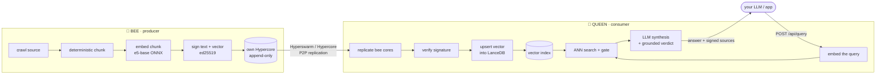
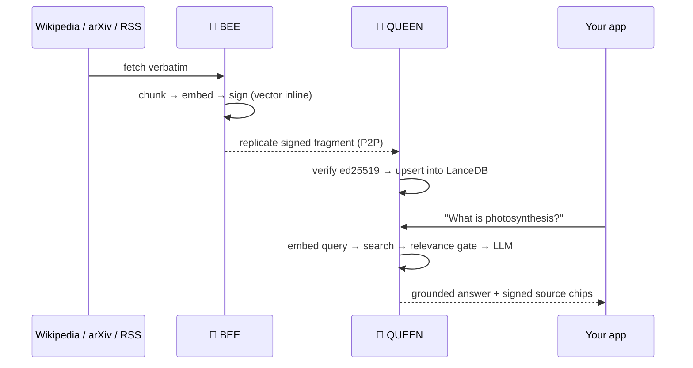

<div align="center">

# 🐝 HIVE

### Wikipedia for machines — a decentralized, verifiable knowledge base built for LLMs.

A peer-to-peer network of autonomous **BEEs** that extract knowledge from the
open web, **sign every fact** with ed25519, and sync it over Hypercore. LLMs
query HIVE to get **up-to-date, source-traceable** answers — no central server,
no black box.

**[Manifesto](./MANIFESTO.md) · [Architecture](./docs/ARCHITECTURE.md) · [Changelog](./CHANGELOG.md)**

</div>

---

## Why HIVE

LLMs are frozen at training time and hallucinate sources. The usual fix — RAG —
means standing up your own crawler, embedder, and vector DB, and trusting
whatever it scraped. HIVE makes that knowledge layer **shared, verifiable, and
serverless**:

- 🔏 **Every fragment is signed.** ed25519 over the text *and* its embedding
  vector. You can prove who produced a fact and that it wasn't altered.
- 🌐 **Peer-to-peer, no middleman.** Nodes find each other over a DHT and
  replicate append-only logs directly. There's no "HIVE Inc." server between
  you and the data.
- 🧠 **Built for retrieval.** Multilingual embeddings (e5-base), deterministic
  chunking, and a tuned relevance gate — ask in Spanish, match an English
  source.
- 🪶 **Run a contributor in one command.** No API key, no cloud bill.

---

## How it works

Two kinds of node. **BEEs** produce knowledge; **QUEENs** consume it.



The key idea: **bees embed, the queen does not.** Each bee computes and signs
its own vectors; the queen just copies them into its index. A queen's
per-fragment cost is a database upsert, not a model forward pass — so a single
queen can aggregate **hundreds** of bees.



→ Full mechanics in **[docs/ARCHITECTURE.md](./docs/ARCHITECTURE.md)**.

---

## Use cases

| | Use case | How HIVE helps |
|---|---|---|
| 🔌 | **Drop-in RAG for your LLM app** | Point `/api/query` at the network and get grounded, cited answers without building a crawler + vector DB. |
| 🏢 | **Private vertical knowledge base** | Run bees scoped to your domain (a category tree, a set of feeds, a corpus) and a private queen — your own verifiable RAG, on your hardware. |
| 🤝 | **Shared knowledge commons** | Many operators run bees on different topics; everyone's queen sees the union. Contribute compute, consume the whole network. |
| 🔎 | **Provenance you can audit** | Every answer traces to signed fragments with source URLs — defensible for compliance, research, journalism. |
| 🌍 | **Cross-lingual retrieval** | Multilingual embeddings match a Spanish question to an English source (and vice-versa) out of the box. |
| 🏠 | **Fully-local, no cloud** | Pair a queen with Ollama for a private agent that never sends a byte to a third party. |

---

## Quick start

Pick what you want to do. Each is shown **with Docker** (nothing to install but
Docker) and **from source** (Node 22+ — no Python, no external services in v0.8).

### 🐝 Contribute — run a BEE
The lightest thing you can run. No key, no LLM.
```bash
git clone https://github.com/capybarist/hive.git && cd hive
docker compose up -d bee-1          # Docker
# — or —
npm install && bash hive.sh          # from source, bee on :8080
```
Open `http://localhost:8080` for the live extraction dashboard. The bee joins
the DHT, claims topics, and starts publishing signed fragments immediately.

### 👑 Query — run a QUEEN
Needs an LLM key (synthesis only). The vector index is an in-process LanceDB —
no separate container.
```bash
cp .env.example .env                 # set QUEEN_LLM_API_KEY (Gemini/Groq/…)
docker compose up -d queen           # Docker
# — or —
npm install && bash queen.sh         # from source, queen on :8090
```
Open `http://localhost:8090` to query. A fresh queen discovers bees over the
DHT and replicates their history, then tracks live.

### 🐝👑 Full stack — QUEEN + BEE + reverse proxy
```bash
cp .env.example .env                 # set QUEEN_LLM_API_KEY
docker compose up -d                 # caddy + bee-1 + queen
docker compose --profile bee-2 up -d # add more bees (auto-coordinate topics)
```
- `http://<host>` → queen UI (Caddy on :80) · `:8080` → bee · `:8090` → queen

### 🏠 Fully-local (Ollama)
```bash
docker compose --profile ollama up -d   # pulls qwen2.5:1.5b
# then in .env:  QUEEN_LLM_PROVIDER=ollama   QUEEN_LLM_MODEL=qwen2.5:1.5b
```

### Dev — 3 nodes on one machine
```bash
bash start.sh            # nodes on :8080 :8081 :8082
bash start.sh --clean    # wipe data and restart
bash stop.sh --force     # kill all
```

> 💡 **Memory:** every node loads the e5-base ONNX model in-process, so budget
> ~900 MB–1 GB per node. A queen + 1 bee fits a 4 GB machine.

> ⚠️ **Upgrading from v0.7.x?** v0.8 is a coordinated **hard reset** (new model,
> new fragment format, new vector store). Follow the cutover runbook in
> [docs/V0.8-MIGRATION.md §10](./docs/V0.8-MIGRATION.md#10-cutover-runbook).

---

## The three modes

| Command | `HIVE_MODE` | Does | LLM key? |
|---|---|---|---|
| `bash hive.sh` *(default)* | `bee` | Extract + embed + sign + own Hypercore. No query API. | No |
| `bash queen.sh` | `queen` | In-process LanceDB + `/api/query`. Embeds only the query. | Yes |
| `HIVE_MODE=hive bash hive.sh` | `hive` | Everything in one process. | Yes |

---

## LLM providers

HIVE uses an LLM in exactly **one place**: query synthesis on the queen. **Bees
never call an LLM** — extraction is a mechanical crawl→chunk→embed→sign loop.
The embedding model (`intfloat/multilingual-e5-base`, ONNX int8) runs in-process
on every node and is *not* an LLM.

| Provider | Cost | Default model |
|---|---|---|
| **Gemini** *(default)* | Generous free tier | `gemini-2.5-flash-lite` |
| **Groq** *(recommended for queens)* | Free 100K tok/day | `llama-3.3-70b-versatile` |
| **Claude** | Paid | `claude-sonnet-4-6` |
| **OpenAI** | Paid | `gpt-4o` |
| **Ollama** | Free, local, slow | `qwen2.5:1.5b` |

Set `QUEEN_LLM_PROVIDER` + `QUEEN_LLM_API_KEY` in `.env`, or switch at runtime
via the UI provider chip. Full config reference:
[docs/ARCHITECTURE.md §10](./docs/ARCHITECTURE.md#10-configuration-reference).

---

## Tech stack

All-Node since v0.8 — no Python, no external database.

- **P2P:** Hyperswarm (DHT discovery) + Hypercore/Hyperbee (signed append-only logs)
- **Identity & integrity:** ed25519 signatures over text + metadata + vector
- **Embeddings:** `intfloat/multilingual-e5-base` (768-d, ONNX int8) via `@huggingface/transformers`
- **Vector store:** LanceDB (embedded, in-process)
- **API:** Fastify + a vanilla-JS dashboard

---

## License

BUSL-1.1 — free to use non-commercially. Converts to MIT after 4 years.
See [LICENSE](./LICENSE) and [MANIFESTO.md](./MANIFESTO.md).
